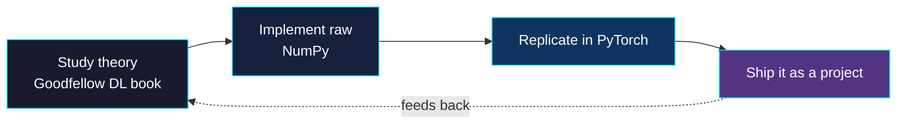
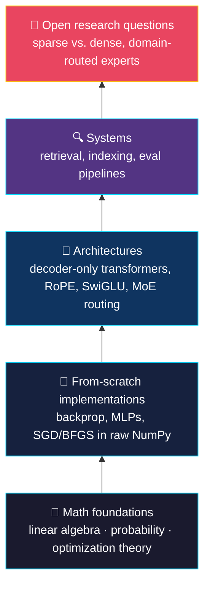
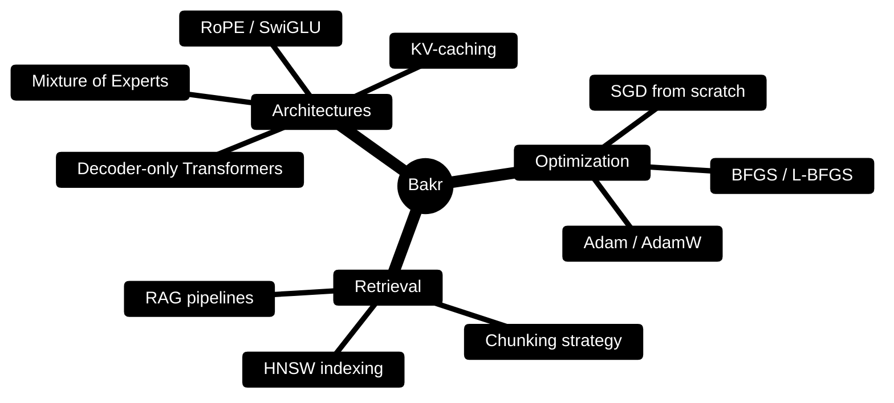

# Hey, I'm Bakr 👋

### I build ML/DL from scratch before I trust a framework with it.

---

## 🧭 The premise

I don't reach for `import transformers` until I've built the thing it's hiding. Second-year CS undergrad at **UESTC**, English-taught track, GPA-flexing quietly. Multilingual (🇲🇦 Arabic · 🇫🇷 French · 🇬🇧 English · 🇨🇳 Mandarin), which mostly just means I read papers and error messages in four languages instead of one.

That loop is the whole methodology. MLE/MAP → backprop → MLP in NumPy → MLP in PyTorch. Same pattern, every layer up.

---

## 🧬 How the understanding stacks

Not a project timeline — a depth chart. Each layer only gets built once the one below it actually holds.

---

## 🧠 What's in the stack

| Layer | Tools |
|---|---|
| **Languages** |   |
| **ML Core** |  |
| **Retrieval** | |

---

## 🎯 Where this is going

- 🧠 Push sparse, domain-routed architectures (MoE) past the "nice idea" stage into results that hold up under real benchmarks
- 🔬 Build a research career at the intersection of neural architecture design and efficient training on constrained compute
- 📖 Get into a top-tier ML/DL graduate program and keep working the theory-to-implementation loop at research scale
- 🚀 Long-term: contribute architectures and training techniques that push what's possible in language and reasoning models — not just use them

---
